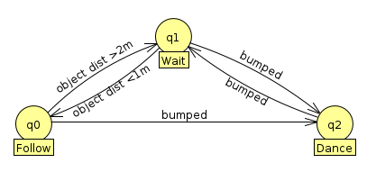

#Warmup Project Writeup

##Behaviors:

###Robot Teleop
We needed to make a basic robot controller that would respond to key commands and move accordingly. For the most part, this problem was designed to help us explore topics in ROS and figure out basic movement on our own terms before we offloaded it onto autonomous scripts. Because this was such a basic problem, there were no really tricky parts or difficulties.

###Driving in a Square
This problem was a bit more interesting. We were charged with making the robot draw a square using either timed turns or the onboard odometer to figure out whether it was making ninety degree turns correctly. Our approach involved using the onboard odometer because we felt like it would be more precise and teach us how to effectively use the odometer for the future. We had a lot of trouble making the turns even, because even with the odometer, there was enough over/under-turning that the square was usually lopsided. To solve, this, we designed the conditions for each turn to end in such a way that the average error would even out. Given enough turns, it would average correct squares. We also ran into difficulty in the way the odometer represented data. The topic published turn information in quaternary, which we couldn't effectively use, so we had to find and use a conversion function that took the quaternary information and turned it into degrees.

###Wall Following
For this exercise, we were required to make the robot approach and follow a wall autonomously, dealing with corners and curved walls in stride. We approached this problem by figuring out which degrees of the 360 degree laser scanner were most appropriate for keeping the robot within a predetermined distance from the wall and following it in a roughly straight line. We wanted to avoid strange behavior like zigzagging or stopping and starting, so we gave it default behaviors that kept it moving, even when it wasn't receiving input from the laser scanner. We ended up using 30 degrees as the forward guide and 120 degrees as the back guide, and used those as anchors to keep the robot oriented. We ran into some trouble when the robot couldn't effectively decide which way to follow the wall, but that was easily solved by defaulting it to traveling left.

###Person Following
The problem we were faced with was how to make a robot fixate on and follow something around it. At first glance, this problem has a large number of answers, most of which are fairly sophisticated. After some thought, we realized we could implement a rudimentary version of a person follower by using the laser scanner to detect the closest object, have the robot center itself "looking" at that object, and having the robot follow any moves the object makes. We did this by having the robot monitor its front 40 degrees until the detected object was the closest. Once that was the case, it usually only reacted to changes in the focussed object, but could be distracted if something moved between it and the object. When there is nothing within the minimum range, the robot spins around, looking for something to latch onto. We had a bit of trouble figuring out what the size of the focussed range should be. Too large meant the robot would be distracted too easily, and too small would mean it couldn't react to changes in direction as easily. We ended up settling on a happy medium at a range of 40 degrees, which allowed for sufficient reactiveness to turns while keeping the robot difficult to distract from its target.

###Obstacle Avoidance
This challenge involved setting a direction or goal for the robot to follow/approach and have it avoid obstacles in the way as it pursued its goal. The first thing that occurred to us when we saw the problem was how we could reuse old code, specifically the wall following code, to support this new behavior. The general idea we came to was to have the robot use the odometer to figure out what the original direction the robot was facing was and follow that direction. If the robot detected an obstacle within a certain critical distance in a cone in front of it, the robot would enter wall following mode and steer around the object until there was nothing in the way, at which point it would stop, face the correct direction, and resume its line. We ran into some small complications when calling old code, because we had to be careful about things like instantiating too many ROS nodes at once, among other interesting, unexpected problems.

###Finite State Controller
The last assignment was to combine past functionality with some new functionality using a finite state controller to manage behavior. The two behaviors we decided on were the person following code from earlier and a new functionality that has the robot "dance" or move around excitedly when the forward bump sensor is triggered. The idea was to have the bump sensor serve as the switch that changed the state of the robot from "following" to "dancing." Though there is little practical use for this combination of functions, the waiting behavior of "dancing" is more interesting than the slight swiveling back and forth that is characteristic of the original person following code. Additionally, the person following code has its own finite state controller that changes between "following" and "waiting" depending on what the laser scanner detects. When there is something to follow within two meters of the robot, it will focus on it and follow it. Otherwise, the robot slowly rotates in a circle and waits. This is effective behavior for person following because it keeps the robot from charging off looking for something to follow or other unpredictable behavior.

##Specifications:
###General Code Structure
The general structure of our code is to have self contained classes that hold all the necessary functionality for that particular behavior. In the `__init__` function of each class, we established necessary instance variables and set up nodes, subscribers, and publishers. We then made helper functions (a common one was `set_vals`, which set Twist values in a more concise manner). Finally, we made `do_the_thing`, which was the main loop. For classes that we wanted to be able to use in other classes, we moved the while loop to outside of `do_the_thing`. For the rest, we put the loop inside of `do_the_thing` and called it at the end of `__init__`.

###Challenges
Though many of the challenges we faced were discussed in the general overviews of all the behaviors, there were a few constant difficulties throughout the project. Most notable of these was the process of learning the tools and tricks of ROS. Rviz is a very powerful tool, but it isn't first timer friendly in the slightest. With a basic walkthrough we managed to get basic functionality, but performing more complex behavior like using markers to map the robot's surroundings proved very difficult and we didn't manage to find much example code on how to do it well.

###Future Work
If we had extra time, we would like to implement a more complicated version of the person follower code that would make the robot only follow moving objects, or objects that had recently moved. The purpose of that would be to avoid it fixating on a wall or a chair and actually be a true person follower. We would accomplish this by using a special topic designed by our professor that projects laser scan values independent of the robot. In other words, when the robot moves or turns, the values of the laser scan don’t change, but it something moves around the robot, that laser value would change. We could use that to help the robot identify moving objects and have it home in on and follow those.

###Key Takeaways
This project was extremely useful for learning how to use various basic tools in ROS, as well as visualization and simulation strategies. We learned how to use Rviz and Gazebo and how to use bag files to test or prove functionality instead of relying on videos or the code itself. We figured out the process of combining unique states to make more complex behaviors, which we believe will be instrumental in creating ever more diverse and adaptive function in the robot.
